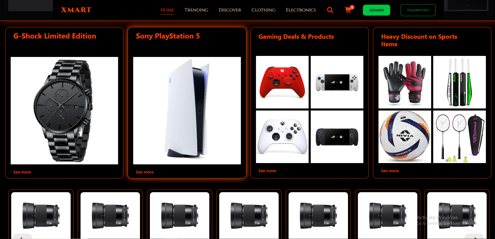
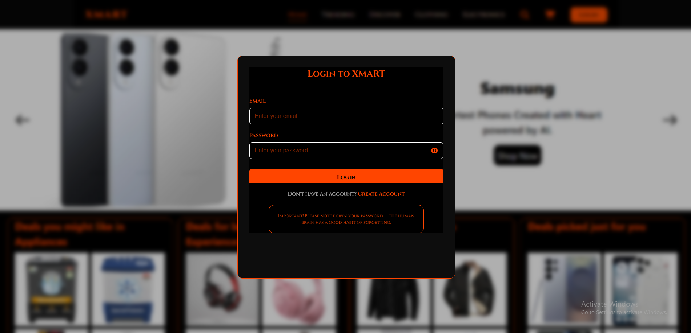
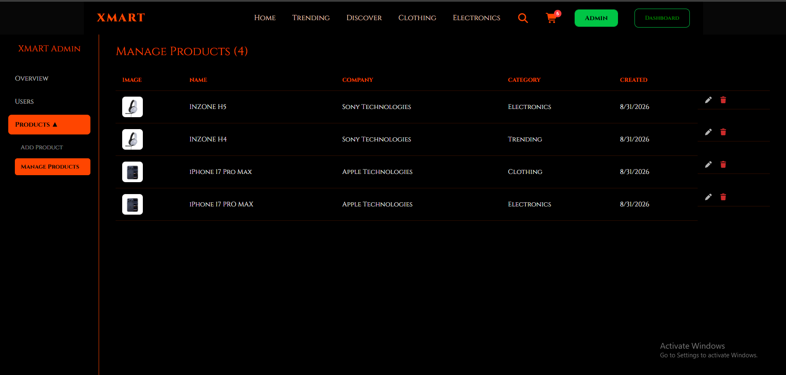
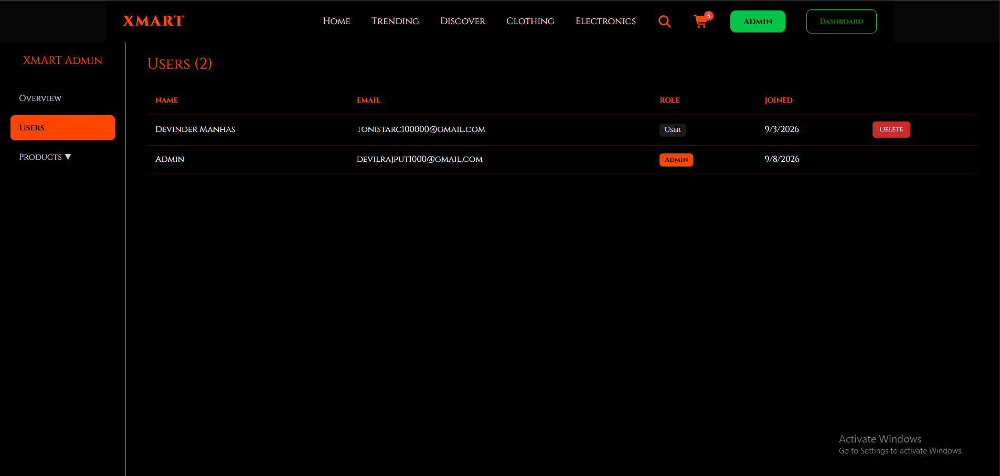
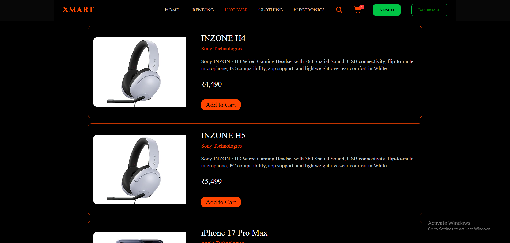

# XMART

A full-stack e-commerce app I built to actually understand how a real online store works under the hood — not just another to-do list clone with a fancy name. XMART is built on the MERN stack and covers the stuff that actually matters in a shopping site: browsing, search, a cart that doesn't forget you, real authentication, and an admin side where products and users are managed.

It's not finished — there's no checkout or payments yet — but everything up to "add to cart" is solid, and I'm using this README to keep track of what's done as much as I'm writing it for anyone checking out the repo.

## Why I built it this way

Most tutorial e-commerce projects store product data twice — once in the products collection, once copied into the cart. That works fine until a price changes and half your users' carts are showing stale numbers. I didn't want that, so the cart in XMART only ever stores a `productId` and a `quantity`. Whenever the cart is read, Mongoose `.populate()` pulls the current product info in at that moment. Change a price, and every cart reflects it instantly — there's nothing to go stale.


## What it actually does

**Storefront**
- Category pages (Electronics, Clothing, Trending, Discover) plus a home page that mixes carousel, grid, hybrid-grid, and row layouts, all driven by the data shape coming from MongoDB.
- Search that ranks results by relevance instead of filtering things out — even a rough or partial match still gets pushed toward the top, so a search never just comes back empty.
- A product modal with a main image and a thumbnail gallery you can click through.
- Layout that uses CSS container queries, so text and spacing scale based on the component's own container rather than the whole viewport — useful when the card shows up in a carousel and a grid at completely different sizes

**Accounts and cart**
- Signup and login share a single modal (rendered through a portal), so there's one auth flow instead of two half-duplicated ones
- Passwords are hashed with bcrypt, sessions run on JWT, and the token gets restored from `localStorage` on page load so refreshing doesn't log you out
- An Axios interceptor attaches the token to every request automatically — no route in the app manually passes a token around
- Cart actions (add, bump quantity, remove) all hit the backend and persist to MongoDB against the logged-in user; nothing lives only in local state
- A cart-count badge in the navbar, kept in sync through React Context

**Admin dashboard**
- Locked behind two checks — you have to be logged in *and* have the Admin role, not just one or the other
- Full product CRUD, including a main image plus up to four gallery images per product
- A user list where non-admin accounts can be viewed and removed
- No public signup path creates an Admin account — the first admin is created once through a seed script, on purpose, so nobody can just sign up their way into the dashboard

## Stack

| | |
|---|---|
| Frontend | React, React Router, Context API, Axios, Framer Motion, Font Awesome |
| Backend | Node.js, Express, MongoDB, Mongoose |
| Auth | JWT, bcrypt |
| Media | Cloudinary, Multer |
| Build tool | Vite |

## Project layout

```
/client
  /src
    /Components
      /Context        → AuthContext, CartContext
      /layout         → Navbar, Footer, layout building blocks
      /ProtectedRoutes → route guards for cart + dashboard
      /CustomHooks    → carousel logic, scroll/viewport hooks
    /Pages            → Home, Trending, Electronics, Discover, Clothing, Cart, Checkout, Admin
    /Services         → api.js — the single Axios instance everything routes through

/server
  /config             → DB connection, Cloudinary setup, seed data/scripts
  /controllers        → auth, cart, products, admin, homepage logic
  /middleware         → JWT guard, admin-role guard
  /models             → User, Products, HomePage schemas
  /routes             → route definitions per resource
```

## Running it locally

You'll need MongoDB (local or Atlas) and a free Cloudinary account for image uploads.

**Backend**
```bash
cd server
npm install
```
Create a `.env` in `/server` with:
```
PORT= any (5001)
CLIENT_URL= any (5173)
MONGO_URI=your_mongodb_connection_string
JWT_SECRET=your_jwt_secret
CLOUDINARY_CLOUD_NAME=your_cloud_name
CLOUDINARY_API_KEY=your_api_key
CLOUDINARY_API_SECRET=your_api_secret
```
```bash
npm run dev
```

**Frontend**
```bash
cd client
npm install
npm run dev
```

## Where it stands

Storefront, auth, cart, and the admin dashboard all work end to end. Checkout and payment integration are next — right now you can fill a cart, but there's no way to actually pay for it yet. That's the honest state of the project as of this commit, not a "coming soon" I'll forget about.


## Screenshots

### Homepage


### Products Grid Designs



### Login/Create Modal




### Admin Dashboard



### Admin User Management 



### Category Pages




